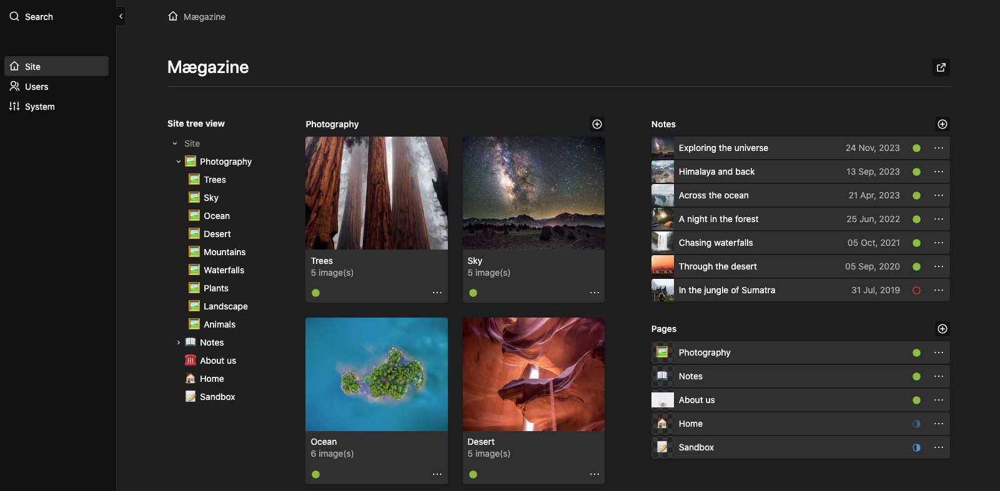

# Arborescence

Arborescence is a minimal tree menu for quickly accessing nested pages in your Kirby panel.

It's a `PagesSection` plugin providing navigation access to nested pages (no actions).

Technically, it simply wraps the native `k-pages-tree` into a panel section ready to use with your blueprints.  
_(The `k-pages-tree` is shown in the page move dialog for example.)_



## Requirements

- Kirby 5 with the panel enabled.
- Maybe v4 works too? (_Report back if it does !_)

## Install

- Manually: Download and copy this repository to `/site/plugins/arborescence`.
- Composer: `composer require daandelange/arborescence`
- Git submodule: `git submodule add https://github.com/daandelange/kirby-arborescence.git site/plugins/arborescence`

## Setup

Add the `arborescence` section to your blueprint :
````yml
sections:
  pages_menu:
    type: arborescence
````

## Options

All section options are optional:
- `label`: A label. (Default = `null`)
- `rootPage`: The root of the menu to display. `site` or `pages/id+sub-id`. (Default = current content page model)
- `showParent`: To show the parent as an antry. (Default = `true`)

### Examples

````yml
# Static artworks menu in `site.yml`
sections:
  artworks_menu:
    type: arborescence
    label: Artworks
    rootPage: 'pages/art'
    showParent: true

# A site tree view in `site.yml`
sections:
  site_menu:
    type: arborescence
    # Labels can be translated too
    label:
      fr: Arborescence du site
      en: Site tree view
    #rootPage: 'site' # uncomment this line to add the same global site menu on another page

# Show page childs in `default.yml` / `other.yml`
sections:
  children_menu:
    type: arborescence
    label: Child Pages
    showParent: false
````


****

## Develop & Build

- Install [kirbyup](https://github.com/johannschopplich/kirbyup) : `pnpm install`
- While coding: `pnpm run dev`
- Production build: `pnpm run build` (creates a minified and optimized version of `index.js` and `index.css`)

****

## Alternatives & Similar

- [Retrotree](https://bitbucket.org/vitamin2/retrotree/) for Kirby 3.
- The [native pages section](https://getkirby.com/docs/reference/panel/sections/pages) (which isn't recursive).

## License

[MIT](./LICENSE.md)

## Credits

- [Daan de Lange](https://daandelange.com/)
